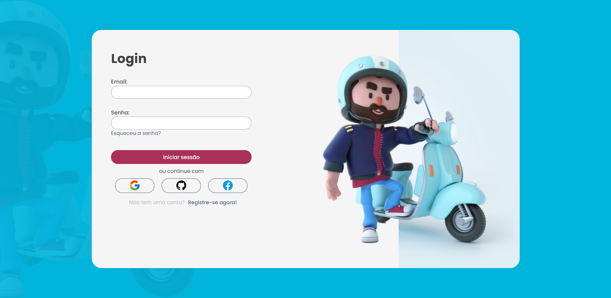
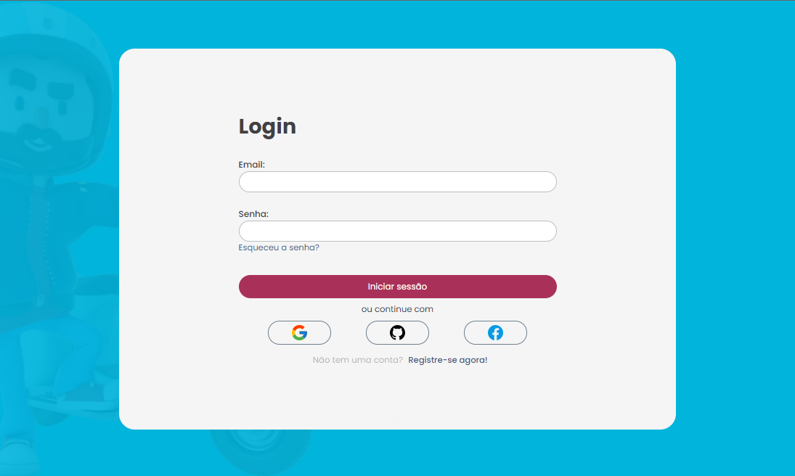
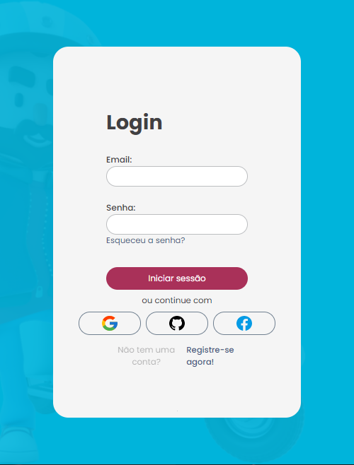

# Página de Login para site de entregas Delivery

* Esse é um projeto de layout de um site estático.
* A parte responsiva (desktop) está funcionando.
* O projeto foi criado no Figma e montado com HTML e CSS.

Arquivo base do Figma: https://www.figma.com/file/B1YstuOzzvOVNFk3dYdIG9/Login-Page-Design-(Community)?node-id=0%3A1

# O resultado foi esse:

